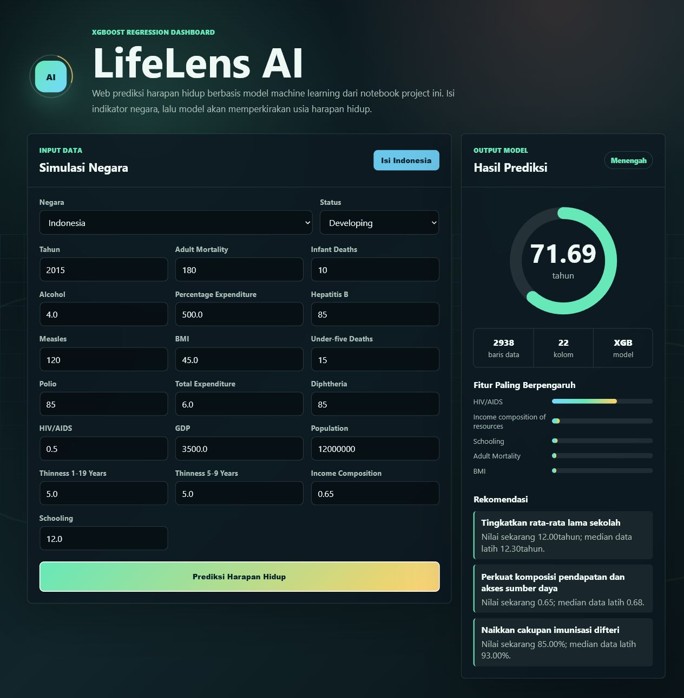

# LifeLens AI Predictor

Web prediksi harapan hidup berbasis model machine learning dari notebook `Tugas_Klp_Ml_1 (1).ipynb`.

> Catatan: nama folder/repo menyebut prediksi keamanan mobil, tetapi dataset dan notebook yang ada di project ini berisi data WHO `Life Expectancy Data (1).csv`. Karena itu web ini dibuat mengikuti model yang benar-benar ada di project, yaitu prediksi `Life expectancy `.

## Fitur Web

- Form input negara, status negara, dan indikator kesehatan/ekonomi.
- Prediksi harapan hidup real-time melalui endpoint Flask `/predict`.
- Tampilan visual dengan background grid animasi, logo orbit AI, progress ring, dan panel rekomendasi.
- Tombol preset `Isi Indonesia` untuk mencoba data contoh dengan cepat.
- Ringkasan fitur paling berpengaruh dari model.

## Model AI

Notebook project melakukan pipeline berikut:

1. Membaca dataset `Life Expectancy Data (1).csv`.
2. Mengisi nilai kosong numerik menggunakan rata-rata.
3. Menangani outlier pada fitur kesehatan, ekonomi, dan sosial memakai metode IQR.
4. Mengubah kolom kategorikal `Country` dan `Status` menjadi angka dengan `LabelEncoder`.
5. Melakukan scaling fitur numerik memakai `StandardScaler`.
6. Melatih beberapa model regresi dan memilih `XGBRegressor` sebagai model utama.

Artifact model disimpan di:

```text
models/life_expectancy_model.joblib
```

Hasil evaluasi training saat ini:

| Metrik | Nilai |
| --- | ---: |
| Model | XGBRegressor |
| R2 Score | 0.9562 |
| RMSE | 2.0541 |
| MAE | 1.3345 |
| Data latih | 2350 baris |
| Data uji | 588 baris |
| Jumlah fitur | 21 |

## Tech Web

- Backend: Flask
- Model serving: joblib + pandas + scikit-learn + XGBoost
- Frontend: HTML, CSS, JavaScript native
- UI: responsive layout, animated grid background, animated AI logo, dan SVG progress ring

## Cara Menjalankan

Install dependency:

```powershell
python -m pip install -r requirements.txt
```

Latih ulang model dari dataset:

```powershell
python scripts\train_model.py
```

Jalankan web:

```powershell
python app.py
```

Buka di browser:

```text
http://127.0.0.1:5057
```

## API Prediksi

Endpoint:

```text
POST /predict
```

Contoh payload:

```json
{
  "Country": "Indonesia",
  "Status": "Developing",
  "Year": 2015,
  "Adult Mortality": 176,
  "infant deaths": 114,
  "Alcohol": 0.08,
  "percentage expenditure": 0,
  "Hepatitis B": 78,
  "Measles ": 15099,
  " BMI ": 27.1,
  "under-five deaths ": 136,
  "Polio": 78,
  "Total expenditure": 2.87,
  "Diphtheria ": 78,
  " HIV/AIDS": 0.3,
  "GDP": 861.4,
  "Population": 258162113,
  " thinness  1-19 years": 1.4,
  " thinness 5-9 years": 1.2,
  "Income composition of resources": 0.686,
  "Schooling": 12.9
}
```

Contoh response:

```json
{
  "category": "Menengah",
  "life_expectancy": 70.62,
  "recommendations": [
    {
      "title": "Naikkan cakupan imunisasi difteri",
      "detail": "Nilai sekarang 78.00%; median data latih 93.00%."
    }
  ],
  "top_features": [
    {
      "feature": " HIV/AIDS",
      "importance": 0.6443658471107483
    }
  ]
}
```

## Screenshot Evidence

Screenshot berikut diambil dari web lokal setelah tombol prediksi dijalankan dan endpoint model mengembalikan hasil.


